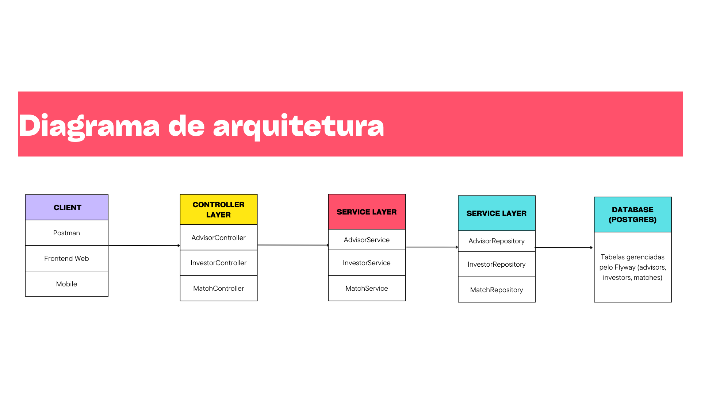
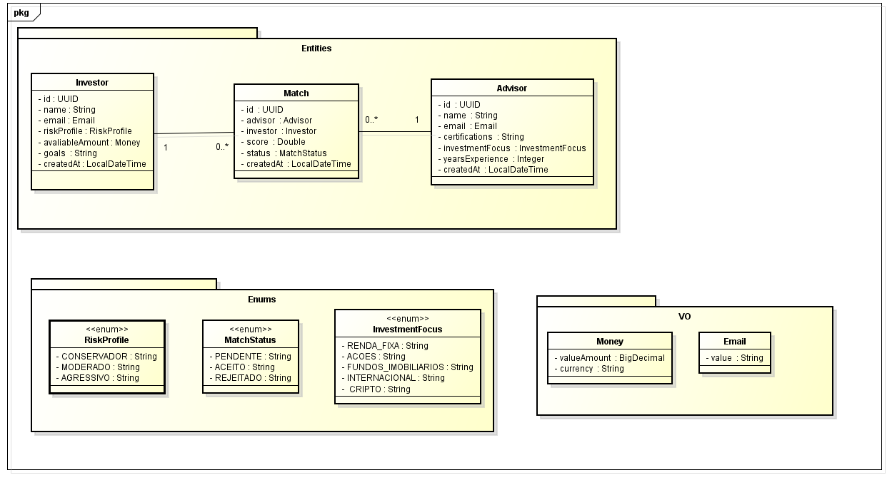
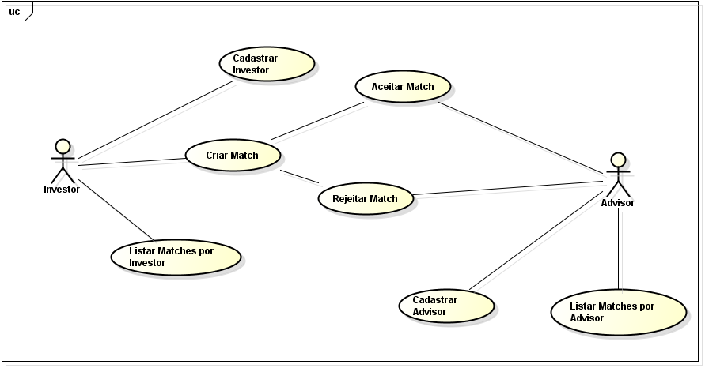

# MatchInvest API

## 📌 Descrição do Projeto
O **MatchInvest** é uma aplicação desenvolvida em **Java com Spring Boot** que conecta **Investidores** e **Assessores de Investimentos**.  
O sistema permite o cadastro e gerenciamento de investidores e assessores, possibilitando criar **matches** entre eles com base em critérios como perfil de risco, foco de investimento e experiência.  

Este projeto foi desenvolvido como parte do trabalho acadêmico, contemplando boas práticas de **arquitetura de software**, **camadas de abstração**, **validações**, **tratamento de erros** e **documentação**.

---

## 🚀 Tecnologias Utilizadas
- **Java 21**
- **Spring Boot 3**
- **Spring Data JPA**
- **PostgreSQL**
- **Flyway** (migração e versionamento do banco de dados)
- **Hibernate Validator** (validações)
- **Lombok**
- **Swagger / Springdoc OpenAPI** (documentação da API)
- **JUnit 5 + Mockito** (testes unitários e de serviço)

---

## 📂 Estrutura do Projeto
A API foi organizada seguindo boas práticas de **arquitetura em camadas**:

```
src/main/java/com/matchinvest/api
│── controllers   # Camada de exposição (endpoints REST)
│── services      # Regras de negócio e lógica da aplicação
│── repositories  # Interfaces para comunicação com o banco (JPA)
│── entities      # Entidades do domínio (mapeamento JPA)
│── dto           # Objetos de transferência de dados (entrada/saída)
│── vo            # Value Objects (como Email e Money)
│── enums         # Enumerações (RiskProfile, InvestmentFocus, MatchStatus)
│── exceptions    # Tratamento centralizado de erros (RestControllerAdvice)
```

---

## ⚙️ Configuração e Execução

### 1️⃣ Pré-requisitos
- Java 21+
- Maven 3.9+
- PostgreSQL 14+
- IDE (IntelliJ, Eclipse ou VSCode)

### 2️⃣ Criar banco de dados no PostgreSQL
```sql
CREATE DATABASE matchinvest;
```

### 3️⃣ Configurar o arquivo `application.properties`
```properties
spring.datasource.url=jdbc:postgresql://localhost:5432/matchinvest
spring.datasource.username=seu_usuario
spring.datasource.password=sua_senha

spring.jpa.hibernate.ddl-auto=validate
spring.jpa.show-sql=true
spring.jpa.properties.hibernate.format_sql=true

spring.flyway.enabled=true
spring.flyway.locations=classpath:db/migration

springdoc.api-docs.enabled=true
springdoc.swagger-ui.enabled=true
```

### 4️⃣ Rodar o projeto
```bash
mvn spring-boot:run
```

### 5️⃣ Baixar a Collection do Postman
- Você pode importar a collection do Postman para testar todos os endpoints da API:  
- [📥 Baixar Collection do Postman](SPRINT03_SOA.postman_collection.json)


### 6️⃣ Acessar a documentação Swagger
- [http://localhost:8080/swagger-ui.html](http://localhost:8080/swagger-ui.html)

---

## 📌 Endpoints Principais

### 🔹 Investor
- `POST /api/investors` → Criar investidor  
- `GET /api/investors` → Listar investidores  
- `GET /api/investors/{id}` → Buscar investidor por ID  
- `PUT /api/investors/{id}` → Atualizar investidor  
- `DELETE /api/investors/{id}` → Deletar investidor  

### 🔹 Advisor
- `POST /api/advisors` → Criar assessor 
- `GET /api/advisors` → Listar assessores 
- `GET /api/advisors/{id}` → Buscar assessor por ID  
- `PUT /api/advisors/{id}` → Atualizar assessor  
- `DELETE /api/advisors/{id}` → Deletar assessor  

### 🔹 Match
- `POST /api/matches` → Criar um match (investidor + assessor)  
- `GET /api/matches/investor/{investorId}` → Listar matches de um investidor  
- `GET /api/matches/advisor/{advisorId}` → Listar matches de um assessor  
- `PATCH /api/matches/{id}/accept` → Aceitar match  
- `PATCH /api/matches/{id}/reject` → Rejeitar match  

---

## 🛠️ Tratamento de Erros
A API possui tratamento centralizado de erros com **RestControllerAdvice**.  
Erros de validação retornam no formato padronizado:

```json
{
  "error": "Validation error",
  "message": "Invalid request fields",
  "fields": [
    {
      "field": "email",
      "message": "E-mail é obrigatório"
    }
  ],
  "timestamp": "2025-09-18T12:08:53.384768-03:00",
  "status": 422
}
```

---

## 🧪 Testes
Foram implementados **testes unitários** utilizando **JUnit 5** e **Mockito**, garantindo a qualidade da camada de serviços.  
Exemplos de testes:  
- Criação de investidores e assessores.  
- Criação de match válido.  
- Validações de campos obrigatórios.  

Rodar os testes:
```bash
mvn test
```

---

## 📊 Diagramas

### 🔹 Arquitetura do Sistema


### 🔹 Diagrama de Classes (Entidades e Relacionamentos)


### 🔹 Diagrama de Casos de Uso


---

## 👨‍💻 Integrantes
- Enzo Luiz Goulart - RM99666  
- Gustavo Henrique Santos Bonfim - RM98864  
- Kayky Paschoal Ribeiro - RM99929  
- Lucas Yuji Farias Umada - RM99757  
- Natan Eguchi dos Santos - RM98720  
